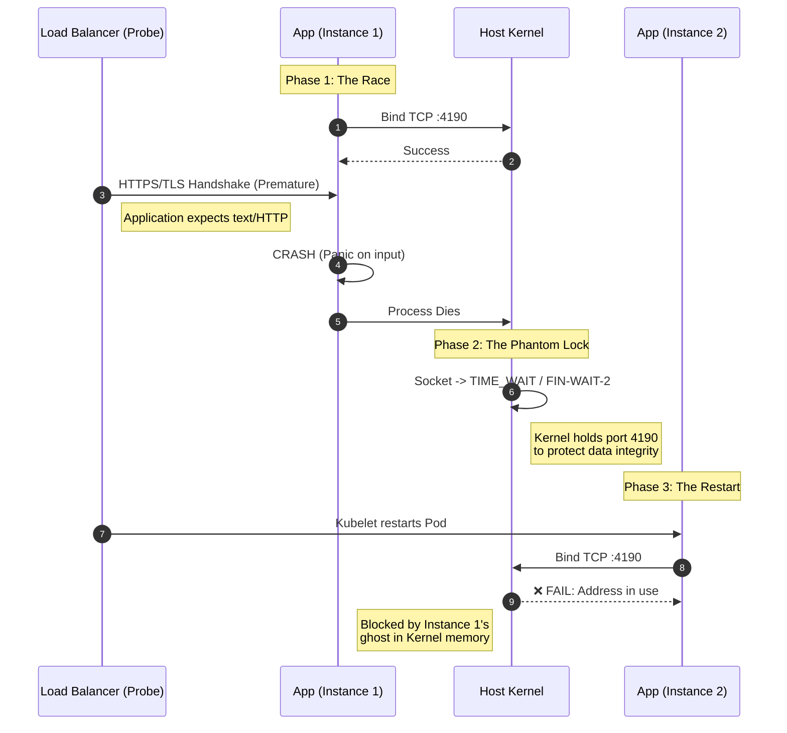

# Head 1

Many writers in antiquity presented their texts as the writings of other, usually famous, people—a practice scholars call pseudepigraphy.

## Head 2

Many writers in antiquity presented their texts as the writings of other, usually famous, people—a practice scholars call pseudepigraphy.

### Head 3

Many writers in antiquity presented their texts as the writings of other, usually famous, people—a practice scholars call pseudepigraphy.

#### Head 4

Many writers in antiquity presented their texts as the writings of other, usually famous, people—a practice scholars call pseudepigraphy.

##### Head 5

Many writers in antiquity presented their texts as the writings of other, usually famous, people—a practice scholars call pseudepigraphy.

## Emphasis

Emphasis, aka italics, with *asterisks* or _underscores_.

Strong emphasis, aka bold, with **asterisks** or __underscores__.

Combined emphasis with **asterisks and _underscores_**.

Strikethrough uses two tildes. ~~Scratch this.~~

## Lists

1. First ordered list item
2. Another item
⋅⋅⋅⋅* Unordered sub-list.
1. Actual numbers don't matter, just that it's a number
⋅⋅⋅⋅1. Ordered sub-list
4. And another item.

⋅⋅⋅You can have properly indented paragraphs within list items. Notice the blank line above, and the leading spaces (at least one, but we'll use three here to also align the raw Markdown).

⋅⋅⋅To have a line break without a paragraph, you will need to use two trailing spaces.⋅⋅
⋅⋅⋅Note that this line is separate, but within the same paragraph.⋅⋅
⋅⋅⋅(This is contrary to the typical GFM line break behaviour, where trailing spaces are not required.)

* Unordered list can use asterisks
- Or minuses
+ Or pluses

## Code and Syntax Highlighting

Inline `code` has `back-ticks around` it.

```javascript
var s = "JavaScript syntax highlighting";
alert(s);
```

```python
s = "Python syntax highlighting"
print s
```

```
No language indicated, so no syntax highlighting.
But let's throw in a <b>tag</b>.
```

## Footnotes

Here is a simple footnote[^1].

A footnote can also have multiple lines[^2].

You can also use words, to fit your writing style more closely[^note].

[^1]: My reference.
[^2]: Every new line should be prefixed with 2 spaces.
  This allows you to have a footnote with multiple lines.
[^note]:
    Named footnotes will still render with numbers instead of the text but allow easier identification and linking.
    This footnote also has been made with a different syntax using 4 spaces for new lines.

## Tables

Colons can be used to align columns.

| Tables        | Are           | Cool  |
| ------------- |:-------------:| -----:|
| col 3 is      | right-aligned | $1600 |
| col 2 is      | centered      |   $12 |
| zebra stripes | are neat      |    $1 |

There must be at least 3 dashes separating each header cell.
The outer pipes (|) are optional, and you don't need to make the
raw Markdown line up prettily. You can also use inline Markdown.

Markdown | Less | Pretty
--- | --- | ---
*Still* | `renders` | **nicely**
1 | 2 | 3

## Blockquotes

> Blockquotes are very handy in email to emulate reply text.
> This line is part of the same quote.

Quote break.

> This is a very long line that will still be quoted properly when it wraps. Oh boy let's keep writing to make sure this is long enough to actually wrap for everyone. Oh, you can *put* **Markdown** into a blockquote.

## Horizontal Rule

Three or more...

---

Hyphens

***

Asterisks

___

Underscores


## Mermaid Diagram



## (Sub,Super)script

H<sub>2</sub>O, foo<sub>bar</sub>

X<sup>2</sup>, foo<sup>bar</sup>
