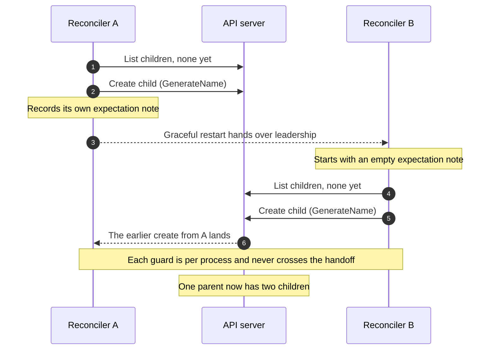

We turned on one setting to make failover faster. It worked. It also surfaced a duplicate the design had been quietly allowing since the day I wrote it.

## A random name, and the guard

The controller, a program that keeps a cluster matching the state you ask for, reconciles a parent into exactly one child. The child's name is not ours to pick: we create it with GenerateName, a fixed prefix and a random suffix the API server assigns. That was deliberate: we never wanted to reuse a name or reason about a fixed one.

There is a cost. The API server enforces uniqueness on the name, not on one child per parent. To the server, two children with different suffixes are two perfectly good objects.

I knew the random name left a gap. The controller reads through a cache that lags the API server, so right after a create the next reconcile can miss the new child and make a second. So before creating, it records an expectation, a note that one is on the way, and will not create again until it sees that create land.

It worked. For two years, not one duplicate.

## The first suspect

Then we turned on release on cancel, a setting that speeds up failover. Weeks later, a routine update wedged on a parent with two children where it should have had one.

My first guess was a regression: some change had broken the expectation, or let a create slip past it. It hadn't. The expectation was intact, doing exactly what I built it for. In one process, it is airtight. In two, it is nothing.

That was the assumption I never wrote down: one process. It lived in the shape of the map. The duplicate had not come from a stale cache. It came from two leaders at once.

## Two leaders

The controller runs as a few replicas with leader election; only the leader reconciles. Normally a departing leader lets its lease expire on its own, about 15 seconds.[^1] Release on cancel hands it back at once.

```go
ctrl.Options{
    LeaderElectionReleaseOnCancel: true, // the line we turned on
}
```

None of that is dangerous alone. Then one ordinary restart lined it up. The old leader was mid-reconcile, blocked on a slow call, when SIGTERM arrived. The drain waited about 30 seconds, then released the lease anyway, the worker still running. A standby took over with none of the 15-second wait that used to cover the gap.



<FigCaption>Each reconciler keeps its own expectation note, so the successor's empty note cannot stop the second create.</FigCaption>

Two reconcilers, each blind to the other's create. One parent, two children, in the same second.

Leader election felt like a promise that one process acts. It is cooperative, not a fence:[^2]

<Callout>this implementation does not guarantee that only one client is acting as a leader (a.k.a. fencing).</Callout>

It does exactly what it promises, which is less than it looks like.

## The fix

The fix was to stop needing the guard at all. Give the child a deterministic name derived from the parent, and the second create collides and is rejected, however many leaders are briefly alive. The invariant moves out of one process's memory into the one place that spans all of them, and the expectation map I was so pleased with is gone.

I had solved the duplicate I could see, one process racing its cache, and missed the one I could not, two processes racing each other. A runnable version is [here](https://github.com/initor/blog-nextjs/tree/master/public/repro/two-leaders-one-second). The bug was one second wide. It just took a month to find something standing on it.

[^1]: controller-runtime's default lease duration is 15 seconds. See the manager defaults in [controller-runtime](https://github.com/kubernetes-sigs/controller-runtime/blob/main/pkg/manager/manager.go).

[^2]: From the leader election package in [client-go](https://github.com/kubernetes/client-go/blob/master/tools/leaderelection/leaderelection.go).
