## Welcome to Preview

This is a sample preview post. It demonstrates how the preview section works:

- **Hidden from navigation**: This post won't appear in the main site navigation
- **Direct URL access only**: Users need the exact URL to view this content
- **Same look and feel**: Uses the same styling as regular blog posts
- **Preview badge**: Notice the "Preview" badge indicating this is a draft

### Use Cases

The preview section is perfect for:

1. Sharing draft posts with reviewers before publishing
2. Testing new content layouts
3. Getting feedback on work-in-progress articles

### Moving to Production

When you're ready to publish a preview post, simply move the `.mdx` file from `src/content/preview/` to `src/content/blog/`.

Happy writing!

### Mermaid Diagram

```mermaid
sequenceDiagram
    autonumber
    participant LB as Load Balancer (Probe)
    participant A1 as App (Instance 1)
    participant KERN as Host Kernel
    participant A2 as App (Instance 2)

    Note over A1: Phase 1: The Race
    A1->>KERN: Bind TCP :4190
    KERN-->>A1: Success

    LB->>A1: HTTPS/TLS Handshake (Premature)
    Note right of LB: Application expects text/HTTP

    A1->>A1: CRASH (Panic on input)
    A1->>KERN: Process Dies

    Note over KERN: Phase 2: The Phantom Lock
    KERN->>KERN: Socket -> TIME_WAIT / FIN-WAIT-2
    Note right of KERN: Kernel holds port 4190<br/>to protect data integrity

    Note over A2: Phase 3: The Restart
    LB->>A2: Kubelet restarts Pod
    A2->>KERN: Bind TCP :4190
    KERN-->>A2: ❌ FAIL: Address in use
    Note left of KERN: Blocked by Instance 1's<br/>ghost in Kernel memory
```

