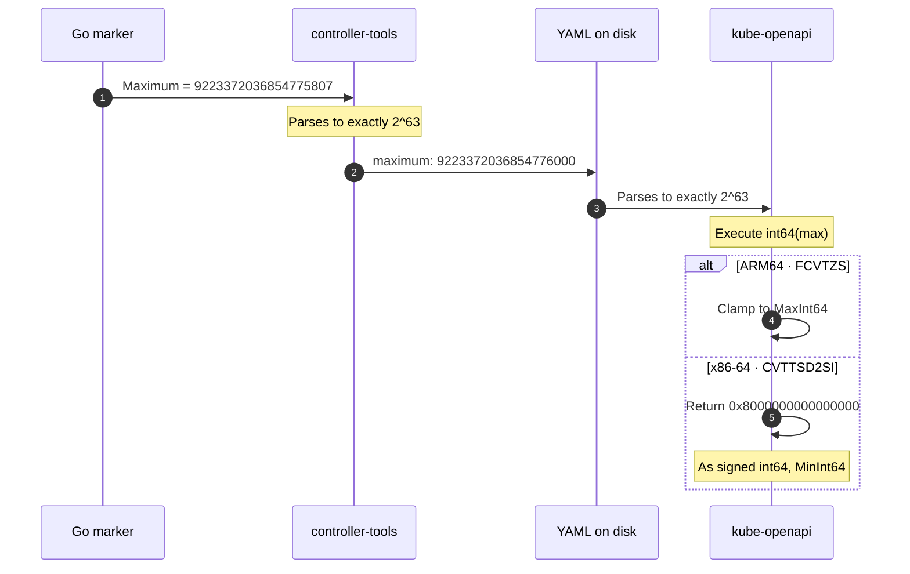

We set a CRD field's maximum to MaxInt64, `9223372036854775807`. It worked on ARM. On x86, the same maximum became MinInt64, `-9223372036854775808`, so the apiserver rejected even the value `1`.

## The first suspect

Every local run passed on an ARM-based M4 MacBook, while the same commit failed on x86. I blamed the infrastructure. Then I opened the failing job:

```text
Invalid value: 1: someField in body should be
less than or equal to -9223372036854775808
```

It was not an infrastructure failure. The largest int64 had become the smallest. I had assumed that the number written in the Go source was the number the apiserver would enforce.

## The number on disk

The marker was straightforward:

```go
// +kubebuilder:validation:Maximum=9223372036854775807
SomeField int64 `json:"someField"`
```

Controller-tools parsed the maximum into a float64, and Kubernetes stored it as one.[^1] MaxInt64 needs 63 bits of precision; float64 keeps 53.[^2] The value therefore rounded up before the YAML was generated:

```yaml
someField:
  format: int64
  maximum: 9223372036854776000
```

The stored float was exactly 2^63, one past the largest int64. Controller-gen serializes the schema through Go's JSON encoder, so the decimal on disk is the shortest representation that parses back to that float.[^3] Controller-tools and the apiserver both parsed their inputs correctly, but they did not receive the same input. By the time the schema reached the apiserver, its maximum was already outside the int64 range it was meant to constrain.

## Where the architectures disagree

Kube-openapi narrows the float64 bound in one expression:[^4]

```go
return MaximumInt(path, in, value, int64(max), exclusive)
```

`int64(max)` converts 2^63, which does not fit. If `max` were a constant, this would not compile. At runtime, for a non-constant conversion, the specification is explicit:[^5]

<Callout>the conversion succeeds but the result value is implementation-dependent.</Callout>

On every 64-bit target, the compiler lowers this conversion to a single native instruction with no range check.[^6] On ARM, `FCVTZS` clamps positive overflow to MaxInt64. On x86, `CVTTSD2SI` returns the invalid-result sentinel `0x8000000000000000`, which as a signed int64 is MinInt64. The validator therefore accepts only MinInt64 on x86 and rejects every greater value.



<FigCaption>The architecture matters only when kube-openapi narrows the out-of-range float64 back to int64.</FigCaption>

The toolchain does guard this path. It rejects a non-integral bound on an integer field.[^7] But 2^63 as a float64 is perfectly integral. Someone checked. They checked the wrong invariant.

## Why "almost nobody" hits this

Near 2^63 the float64 grid is 1024 wide, so only the highest 512 int64 values round outside the int64 range. Below that window the bound still narrows to a real int64, so validation works, but against the rounded value, which can sit above the one you wrote. MaxInt64 sits inside that window. It is exactly what a careful engineer reaches for when a rule demands a Maximum but the field has no real ceiling.

The failure is loud on x86 and invisible on ARM. ARM was never a control. It was a blindfold.

## The fix

We moved the ceiling out of the marker and into a validating admission webhook. The check stays in compiled Go, with an int64 on both sides, so the maximum bound never crosses the float64 schema path. The cost is a service and certificates.

That fixed our field, but not the schema path. A round-trip guard only works in controller-tools, where the literal still exists; by the time the apiserver decodes the YAML, `9223372036854776000` round-trips exactly and there is nothing left to detect. The validator needs a different guard: range-check the bound before narrowing it.

Kubernetes 1.36 turned one on.[^8] The bound is now rejected outright, on every architecture, so the field is unusable rather than inverted. `int64(max)` is still in the source. Nothing reaches it anymore.

Supporting MaxInt64 at all still requires carrying the bound as an exact number through generation and validation, then comparing integers without `int64(max)`.

The broader rule: above 2^53, float64 stops representing every consecutive integer, so a schema tool that stores bounds as float64 can enforce a different value from the one in source.[^9] A [runnable repro](https://github.com/initor/blog-nextjs/tree/master/public/repro/the-maximum-became-the-minimum) includes the arithmetic and the pinned validator.

The compiler knew. It just never got to see the number.

[^1]: Controller-tools declares [`Maximum float64`](https://github.com/kubernetes-sigs/controller-tools/blob/41fba8525412a0a09a6df3014b9a7f88650584b3/pkg/crd/markers/validation.go#L192); Kubernetes stores `maximum` as [`Maximum *float64`](https://github.com/kubernetes/apiextensions-apiserver/blob/ecdf037a687464c62ac46bfefa3e56648d4bda0d/pkg/apis/apiextensions/v1/types_jsonschema.go#L80).

[^2]: Go's `float64` is an [IEEE-754 64-bit float](https://go.dev/ref/spec#Numeric_types); binary64 carries a 53-bit significand, 52 stored and one implicit.

[^3]: Controller-gen marshals the schema through [`json.Marshal`](https://github.com/kubernetes-sigs/controller-tools/blob/41fba8525412a0a09a6df3014b9a7f88650584b3/pkg/genall/genall.go#L173-L175) before converting to YAML, and Go's JSON encoder uses fixed notation and the shortest round-trip representation in [`encode.go`](https://github.com/golang/go/blob/a9ce111d580581fb925ae88f125c69b7d93504ea/src/encoding/json/encode.go#L584-L592).

[^4]: Kube-openapi assumes the lossy conversion was checked beforehand, then narrows with `int64(max)` in [`MaximumNativeType`](https://github.com/kubernetes/kube-openapi/blob/c8a335a9a2ff/pkg/validation/validate/values.go#L245-L257).

[^5]: The Go [conversion specification](https://go.dev/ref/spec#Conversions) makes an unrepresentable runtime result implementation-dependent and rejects overflowing constants.

[^6]: `go tool compile -S` emits `FCVTZSD` on arm64 and `CVTTSD2SQ` on amd64, with no range check either side; the [repro](https://github.com/initor/blog-nextjs/tree/master/public/repro/the-maximum-became-the-minimum) carries the disassembly. Arm's [`FPToFixed`](https://developer.arm.com/documentation/ddi0602/latest/Shared-Pseudocode/AArch64-Functions/Shared-Floating-point-functions?lang=en#func_FPToFixed_7) generates a saturated result; x86 [`CVTTSD2SI`](https://www.felixcloutier.com/x86/cvttsd2si) returns the integer indefinite value when the invalid exception is masked.

[^7]: Controller-tools checks only [integrality](https://github.com/kubernetes-sigs/controller-tools/blob/41fba8525412a0a09a6df3014b9a7f88650584b3/pkg/crd/markers/validation.go#L703-L704) before storing the bound unmodified.

[^8]: Kube-openapi [#570](https://github.com/kubernetes/kube-openapi/pull/570) populates `Type` and `Format` on the number validator, which activates an existing range check on the bound. Kubernetes 1.36 vendors that commit; 1.35 and earlier do not.

[^9]: RFC 8259 defines the [interoperable integer range](https://www.rfc-editor.org/rfc/rfc8259.html#section-6). Issue [#464](https://github.com/openai/openai-openapi/issues/464) in `openai/openai-openapi` records the same rounded bound.
