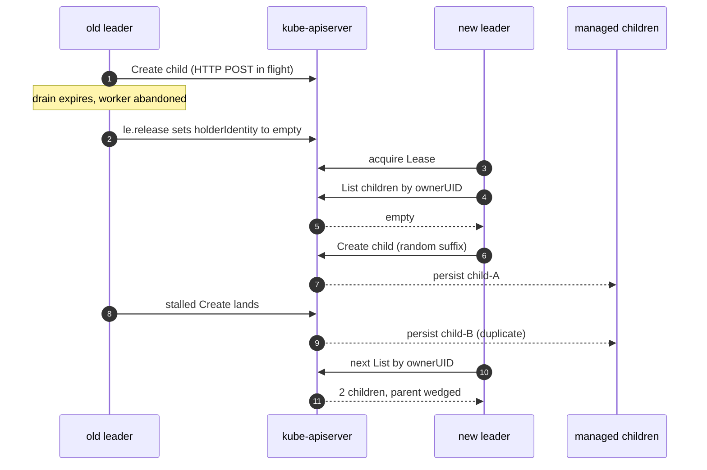

A routine rolling restart of a controller I work on produced **two children for one parent in the same UTC second**. Our in-memory [expectations](/blog/cloneset-pod-thrashing) layer, the abstraction that normally prevents firing a second `Create` while one is still pending, did not catch it for 29 days: the duplicate `Create` came from a different process. When the next reconcile tried to update the child, it found two and refused. The rollout wedged.

The bug was not in the controller's code. It was in an assumption: that Kubernetes leader election guarantees mutual exclusion. It does not.

<Callout>A worker inside <code>Reconcile()</code> outlasted the 30 second graceful drain. The lease released and the new leader acquired, but the old worker&apos;s in flight <code>client.Create</code> was still on the wire. It landed at the apiserver beside the new leader&apos;s. Two children. One parent.</Callout>

## Why Each Step Was Possible

Three latent conditions held in the controller the whole time. A fourth, recent config change pulled the trigger.

**Latent 1: The Lease is not a fencing token.** Either leader can write to the apiserver and the apiserver accepts. The header of [`client-go/tools/leaderelection/leaderelection.go`](https://github.com/kubernetes/client-go/blob/master/tools/leaderelection/leaderelection.go) says so verbatim: *"this implementation does not guarantee that only one client is acting as a leader (a.k.a. fencing)."*

**Latent 2: The graceful drain is cooperative, not preemptive.** controller-runtime&apos;s `StopAndWait` selects on the worker WaitGroup against a 30 second `shutdownCtx`. If the timeout wins, the WaitGroup is abandoned, the worker inside `Reconcile()` keeps running with its HTTP POST on the wire, and the lease releases via a deferred cleanup a few lines later.

**Latent 3: Managed children carry non-deterministic names. This is the root cause.** Each `Create` allocates a fresh random suffix (via `GenerateName`), so two concurrent Creates produce two different names and no collision at the apiserver. With deterministic names derived from the parent, the second writer would get `409 AlreadyExists` and treat it as a benign requeue. The other two latent conditions open the race window; non-deterministic names are what let the race produce a wedged parent instead of a recoverable error.

**Trigger: `LeaderElectionReleaseOnCancel=true`.** We enabled this recently so the leader proactively writes `holderIdentity = ""` to the Lease on graceful shutdown. The standby then acquires in milliseconds instead of waiting ~15 seconds for the lease to expire. Faster failover is a real feature. It also compressed the new leader&apos;s first reconcile sweep into the same window the old worker&apos;s in-flight `Create` was still being processed on the apiserver. This trigger raised the hit rate from theoretical to every rolling restart.

Remove any one of the three latent conditions and the bug class collapses. Remove the trigger and it falls back to theoretical, where it sat for years.

## Where Every Line Fires



## Reproduce

Here is a 150 line controller that reproduces the bug in any kind cluster. `ConfigMap` is the parent, `Secret` is the child, both stock built-in types. Both writers reconcile the same parent concurrently (leader election bypassed); both call `client.Create` with the same `GenerateName` base; the apiserver accepts both.

### The reconciler

```go
func (r *reconciler) Reconcile(ctx context.Context, req reconcile.Request) (reconcile.Result, error) {
  var children corev1.SecretList
  if err := r.List(ctx, &children,
    client.InNamespace(req.Namespace),
    client.MatchingLabels{"demo-child": req.Name}); err != nil {
    return reconcile.Result{}, err
  }
  if len(children.Items) >= 1 {
    return reconcile.Result{}, nil
  }
  if r.forceRace {
    time.Sleep(10 * time.Second) // models a slow downstream call
  }
  child := &corev1.Secret{
    ObjectMeta: metav1.ObjectMeta{
      GenerateName: req.Name + "-child-",
      Namespace:    req.Namespace,
      Labels:       map[string]string{"demo-child": req.Name},
    },
  }
  return reconcile.Result{}, r.Create(ctx, child)
}
```

### Run it

```bash
kind create cluster --name leader-race
go mod tidy

# Terminal A
WRITER_ID=A go run . --force-race

# Terminal B
WRITER_ID=B go run . --force-race

# Terminal C
kubectl create configmap demo-parent
kubectl label cm demo-parent demo=parent
sleep 12
kubectl get secrets -l demo-child=demo-parent
```

```
NAME                       AGE
demo-parent-child-9j2pk    2s
demo-parent-child-pkx4f    2s
```

Two children. One parent. The same state production lived with for 29 days. Reproducing the exact production timing (in-flight `Create` surviving the drain) requires apiserver-side slowness, typically a slow webhook; the structural demo suffices because the outcome is identical.

Full source: [`main.go`](/repro/two-leaders-one-second/main.go), [`go.mod`](/repro/two-leaders-one-second/go.mod), [`README.md`](/repro/two-leaders-one-second/README.md).

## The Fix

### Deterministic names for managed resources

Derive child names from the parent (for example, `<parent.name>-<role>` or `<parent.name>-<n>`) instead of letting `GenerateName` allocate a fresh suffix per `Create`. The apiserver already enforces `(namespace, name)` uniqueness. Two leaders racing now produce one persistent child and one `AlreadyExists`, not two children. (Existing children carry random suffixes and `metadata.name` is immutable, so a one-shot migration job per parent creates the deterministic child and removes the legacy one.)

Once names are deterministic, Server-Side Apply with a `FieldOwner` is a clean follow-up. `Apply` is idempotent at the apiserver and targets a specific `(namespace, name)`, so the race becomes a no-op on the loser and the in-memory expectations layer becomes redundant. (SSA does not help on its own: `Apply` needs a known target name, so it presumes the deterministic-name fix above.)

For defense in depth, add a top-level `ReconciliationTimeout` so no single `Reconcile` outlives the drain. This removes the slow-Reconcile precondition before the architectural fix ships.

Keep `LeaderElectionReleaseOnCancel=true`. The bug is the latents, not the trigger.

## Five Things to Check in Your Own Controller

1. Do any managed child resources carry non-deterministic names (typically via `GenerateName`)? Non-deterministic names plus leader election equal this bug.
2. Does `Reconcile` call external services without per-call timeouts? The static budget matters, not the average.
3. Is there a top-level `Reconcile` deadline? controller-runtime imposes none.
4. Is `LeaderElectionReleaseOnCancel=true`? It compresses handoff from ~15s to ~1s, turning checks 1 through 3 from theoretical into routine.
5. Is your uniqueness constraint enforced server-side? Expectations live in one process; an admission webhook lives in the apiserver. Only the second one survives controller bugs.

## Hints, Not Fences

The Lease is a hint. The apiserver is the fence. Put your invariants where two leaders cannot disagree.

Non-deterministic names trade that fence for a promise: that the controller&apos;s expectations layer will block the second `Create` before it fires. That promise lives in one process, on a happy day. It does not survive a lease handoff, a partial restart, or any moment two writers think they are the only writer. Use names the apiserver can hold.
